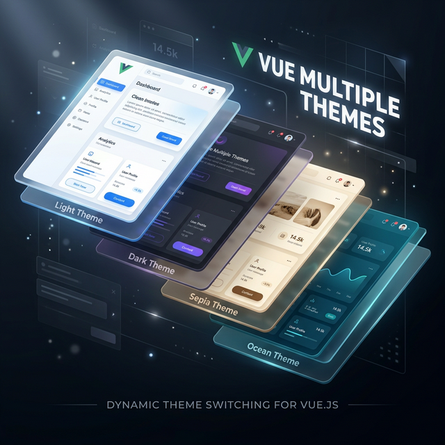

<p align="center">
  
</p>

# vue-multiple-themes

> Dynamic multi-theme support for **Vue 3** — CSS custom properties, TailwindCSS, WCAG contrast utilities, and a reactive composable API.

[](https://www.npmjs.com/package/vue-multiple-themes)
[](LICENSE)

---

## Development

> **Prerequisites:** [pnpm](https://pnpm.io) v9+ and Node.js v18+

```bash
# Install all workspace dependencies
pnpm install

# Run the interactive playground (Vite dev server → http://localhost:5173)
pnpm dev

# Run the documentation site (VitePress → http://localhost:5173)
pnpm docs:dev

# Run playground AND docs simultaneously (two ports in parallel)
pnpm dev:all

# Build the library
pnpm build
```

---

## Features

- **Vue 3 Optimized** — leverage the latest Composition API and `<script setup>`
- **TypeScript** — full type definitions included
- **CSS custom properties** — semantic `--vmt-*` variables injected automatically
- **TailwindCSS plugin** — `bg-vmt-primary`, `text-vmt-foreground`, etc.
- **7 preset themes** — light, dark, sepia, ocean, forest, sunset, winter
- **Dynamic theme generation** — create themes from a single brand color
- **Color utilities** — lighten, darken, mix, contrast ratio, WCAG compliance
- **`useTheme()` composable** — reactive, SSR-safe, localStorage-persistent
- **Zero runtime dependencies** (only `vue` peer dependency)

---

## Installation

```bash
# pnpm (recommended)
pnpm add vue-multiple-themes

# npm
npm install vue-multiple-themes

# yarn
yarn add vue-multiple-themes
```

---

## Quick Start

### Vue 3 — Composition API

```ts
// main.ts
import { createApp } from 'vue';
import { VueMultipleThemesPlugin } from 'vue-multiple-themes';
import App from './App.vue';

const app = createApp(App);
app.use(VueMultipleThemesPlugin, {
  defaultTheme: 'dark',
  strategy: 'attribute', // 'attribute' | 'class' | 'both'
  persist: true,
});
app.mount('#app');
```

```vue
<!-- App.vue -->
<script setup lang="ts">
import { useTheme, PRESET_THEMES } from 'vue-multiple-themes';

const { currentTheme, setTheme, themes } = useTheme({ themes: PRESET_THEMES });
</script>

<template>
  <button v-for="t in themes" :key="t.name" @click="setTheme(t.name)">
    {{ t.label }}
  </button>
</template>
```

### Vue 2 — Plugin

```js
import Vue from 'vue';
import { VueMultipleThemesPlugin } from 'vue-multiple-themes';

Vue.use(VueMultipleThemesPlugin, { defaultTheme: 'light' });
```

---

## CSS Custom Properties

Themes inject `--vmt-*` CSS variables on the target element (default: `<html>`):

```css
.card {
  background: var(--vmt-background);
  color: var(--vmt-foreground);
  border: 1px solid var(--vmt-border);
}
```

---

## TailwindCSS Integration

```js
// tailwind.config.js
const { createVmtPlugin } = require('vue-multiple-themes/tailwind');

module.exports = {
  plugins: [createVmtPlugin()],
};
```

Generates utilities: `bg-vmt-primary`, `text-vmt-foreground`, `border-vmt-border`, `ring-vmt-ring`.

---

## Preset Themes

| Name     | Description           |
| -------- | --------------------- |
| `light`  | Clean white + indigo  |
| `dark`   | Dark gray + violet    |
| `sepia`  | Warm parchment browns |
| `ocean`  | Deep sea blues        |
| `forest` | Rich greens           |
| `sunset` | Warm oranges & reds   |
| `winter` | Icy blues & whites    |

```ts
import { PRESET_THEMES, oceanTheme, forestTheme } from 'vue-multiple-themes';
```

---

## Dynamic Theme Generation

Create light/dark theme pairs from a single brand color:

```ts
import { generateThemePair } from 'vue-multiple-themes';

const { light, dark } = generateThemePair('#6366f1'); // indigo
```

Generate a full color scale:

```ts
import { generateColorScale } from 'vue-multiple-themes';

const scale = generateColorScale('#6366f1', 9); // 9-step palette
```

---

## Color Utilities

All utilities are SSR-safe (no DOM dependency) and tree-shakeable:

```ts
import {
  lighten,
  darken,
  mix,
  contrastRatio,
  autoContrast,
  checkContrast,
  complementary,
  triadic,
  analogous,
} from 'vue-multiple-themes';

lighten('#6366f1', 0.2); // lighter hex
darken('#6366f1', 0.3); // darker hex
mix('#ff0000', '#0000ff', 0.5); // purple blend
contrastRatio('#000', '#fff'); // 21
autoContrast('#6366f1'); // '#ffffff' or '#000000'
checkContrast('#6366f1', '#fff'); // { ratio, aa, aaa, aaLarge, aaaLarge }
```

---

## API

### `useTheme(options)`

| Option         | Type                               | Default                    | Description                 |
| -------------- | ---------------------------------- | -------------------------- | --------------------------- |
| `themes`       | `ThemeDefinition[]`                | preset list                | Available themes            |
| `defaultTheme` | `string`                           | `'light'`                  | Initial theme name          |
| `strategy`     | `'attribute' \| 'class' \| 'both'` | `'attribute'`              | How theme is applied to DOM |
| `target`       | `string \| Element`                | `document.documentElement` | Target element              |
| `persist`      | `boolean`                          | `true`                     | Save choice to localStorage |
| `storageKey`   | `string`                           | `'vmt-theme'`              | localStorage key            |

**Returns:** `{ currentTheme, currentName, themes, setTheme, nextTheme, prevTheme }`

---

## Documentation

Full documentation and live demos:

**<https://pooyagolchian.github.io/vue-multiple-themes/>**

---

## Development

```bash
pnpm install          # install all workspace packages
pnpm build            # build the library
pnpm test             # run 218+ unit tests
pnpm dev              # playground dev server
pnpm docs:dev         # docs dev server
pnpm docs:build       # build docs for production
```

---

## License

[MIT](LICENSE) © Pooya Golchian
