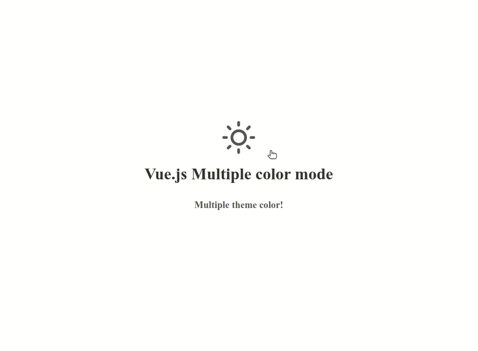

### Vue.js Multiple Themes

1- Vue.js multipe theme and store in array and work with css variable

2- Easy to use and add themes (Color Plallet)



### Install package

1. Install with npm `npm i vue-multiple-themes`
2. Install with yarn `yarn add vue-multiple-themes`

### Code sample

After import and register component in your Vue.js application:

```javascript
<template>
    <div>
        <vue-multiple-themes
        :defaultTheme="'light'"
        :themeColorList="[
        'light',
        'dark',
        'sepia'
        ]"
        :changeThemeOff="true"
        >
    </vue-multiple-themes>
</div>
</template>

<script>
    import VueMultipleThemes from "vue-multiple-themes";
    export default {
    components: {VueMultipleThemes}
};
</script>

```

- You can override and change style and color pallet to array!

```scss
@import "fonts.scss";

:root {
  --app-background-color: #ffffff;
  --app-title-color: #333333;
  --app-subtitle-color: #555555;
}

[theme="dark"] {
  --app-background-color: #333333;
  --app-title-color: #ffffff;
  --app-subtitle-color: #dddddd;
}

[theme="sepia"] {
  --app-background-color: #d0bc91;
  --app-title-color: #8a6c44;
  --app-subtitle-color: #5f4938;
}

.app-background {
  background-color: var(--app-background-color);
}

.app-title {
  color: var(--app-title-color);
}

.app-subtitle {
  color: var(--app-subtitle-color);
  padding-top: 10px;
}

.change-theme-box {
  cursor: pointer;
  color: var(--app-subtitle-color);
  font-size: 1em;
  font-weight: normal;
}
```

## Documents

| Attribute      |                 Description                 |    Type | Default                                               |
| :---: | :--- | :---: | :----: |
| defaultTheme   |                 Color name                  |  String | 'light'                                               |
| themeColorList |               Array of themes               |   Array | ["light", "dark", "sepia"] |
| changeThemeOff | Show or hide change click for change themes | Boolean | true |
| extraClass | Add custom class for icon wrapper | String | null |